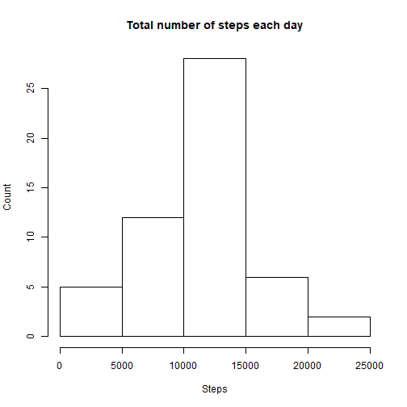
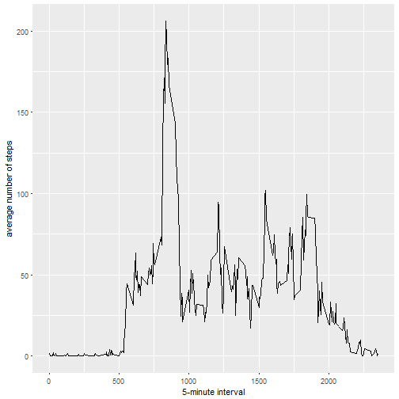
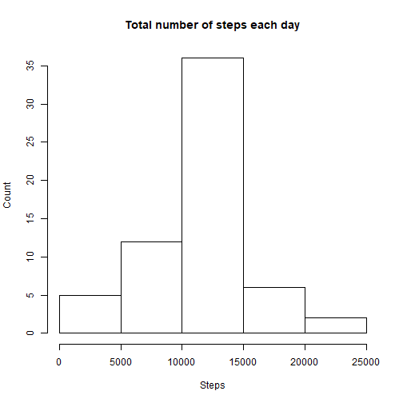
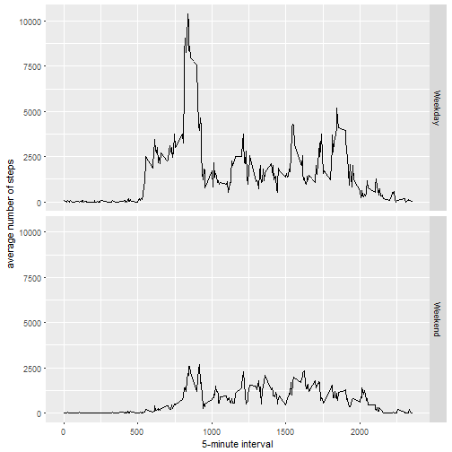

## Loading and preprocessing the data


```r
data <- read.csv("activity.csv")
```

```
## Warning in file(file, "rt"): cannot open file 'activity.csv': No such file
## or directory
```

```
## Error in file(file, "rt"): cannot open the connection
```

```r
head(data)
```

```
##   steps       date interval
## 1    NA 2012-10-01        0
## 2    NA 2012-10-01        5
## 3    NA 2012-10-01       10
## 4    NA 2012-10-01       15
## 5    NA 2012-10-01       20
## 6    NA 2012-10-01       25
```

## What is mean total number of steps taken per day?

1. Calculate the total number of steps taken per day.


```r
total <- aggregate(data$steps, by=list(date=data$date),sum)
sum(total$x,na.rm=1)/nrow(total)
```

```
## [1] 9354.23
```

2. Make a histogram of the total number of steps taken each day.


```r
hist(total$x,main = "Total number of steps each day", xlab = "Steps", ylab = 'Count')
```


3. Calculate and report the mean and median of the total number of steps taken per day.


```r
summary(total)
```

```
##          date          x        
##  2012-10-01: 1   Min.   :   41  
##  2012-10-02: 1   1st Qu.: 8841  
##  2012-10-03: 1   Median :10765  
##  2012-10-04: 1   Mean   :10766  
##  2012-10-05: 1   3rd Qu.:13294  
##  2012-10-06: 1   Max.   :21194  
##  (Other)   :55   NA's   :8
```
The mean of total number of steps taken per day is 10766. The median is 10765.

## What is the average daily activity pattern?


```r
library(ggplot2)
data2 <- aggregate(data$steps, list(data$interval), mean, na.rm=1)
ggplot(data2, aes(Group.1, x)) + geom_line() + xlab("5-minute interval") + ylab("average number of steps")
```



```r
data2[data2$x==max(data2$x),]
```

```
##     Group.1        x
## 104     835 206.1698
```

The 835 interval, on average across all the days in the dataset, contains the maximum number of steps.

## Inputing missing values


```r
sum(is.na(data$steps))
```

```
## [1] 2304
```

There are 2304 missing values in the dataset.

To fill in the missing data, we can use the mean for that 5-minute interval.


```r
newData <- data
for (i in 1:nrow(newData)) {
        if (is.na(newData$steps[i])) {
newData$steps[i] <- data2[which(newData$interval[i] == data2$Group.1), ]$x
        }
}
```


```r
newTotal <- aggregate(newData$steps, by=list(newData$date), sum)
hist(newTotal$x, main = "Total number of steps each day", xlab = "Steps", ylab = 'Count')
```




```r
summary(newTotal)
```

```
##        Group.1         x        
##  2012-10-01: 1   Min.   :   41  
##  2012-10-02: 1   1st Qu.: 9819  
##  2012-10-03: 1   Median :10766  
##  2012-10-04: 1   Mean   :10766  
##  2012-10-05: 1   3rd Qu.:12811  
##  2012-10-06: 1   Max.   :21194  
##  (Other)   :55
```

The mean of total number of steps taken per day is 10766. The median is 10766.
The median is a little different from the first part of the assignment. Imptuting missing data on the estimates of the total daily number of steps will make the total daily number of steps larger.

## Are there differences in activity patterns between weekdays and weekends?

Create a new factor variable in the dataset with two levels - "weekday" and "weekend" indicating whether a given date is a weekday or weekend day.


```r
newData$date <- as.Date(newData$date)
newData$weekday <- weekdays(newData$date)
newData$date.type <- ifelse(newData$weekday == "Saturday"|newData$weekday == "Sunday", "Weekend", "Weekday")
newData$date.type <- factor(newData$date.type)
```

Make a panel plot containing a time series plot (i.e. type = "l") of the 5-minute interval (x-axis) and the average number of steps taken, averaged across all weekday days or weekend days (y-axis).


```r
panelData <- aggregate(newData$steps, by=list(interval=newData$interval, weekdayType=newData$date.type), sum)
ggplot(panelData, aes(interval,x)) + geom_line() + facet_grid(weekdayType~.)+xlab("5-minute interval") + ylab("average number of steps")
```




